# Introduction

This repository is a test project by creating a todo app.

# Login Page

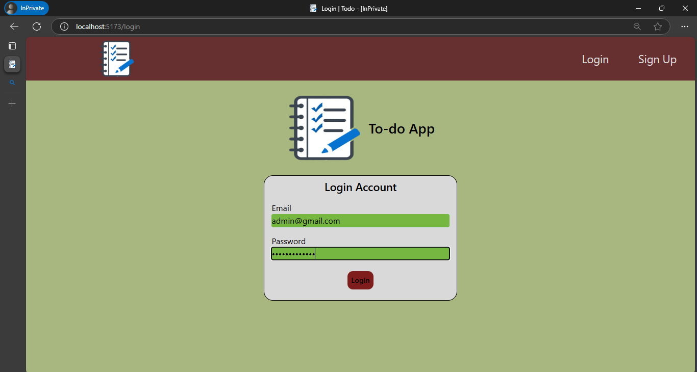

# Signup Page

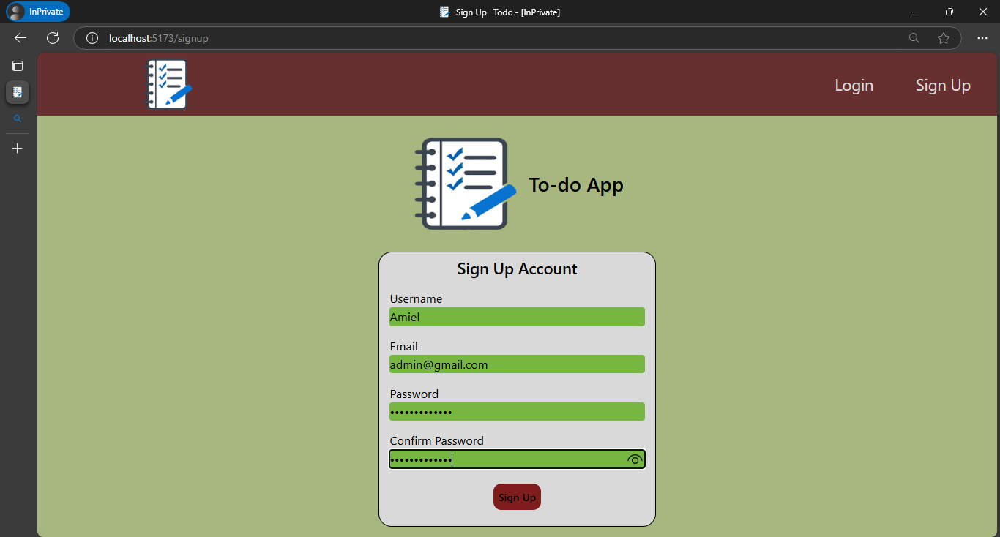

# Creating a Task Page

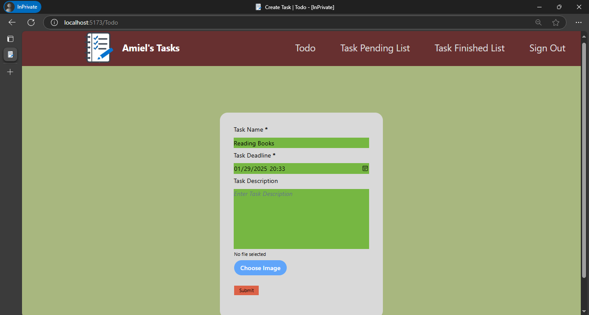

# Task Pending Page

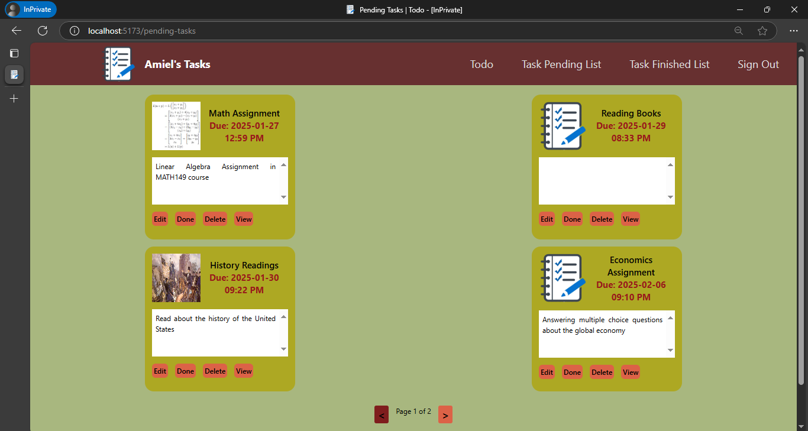

# Task Finished Page

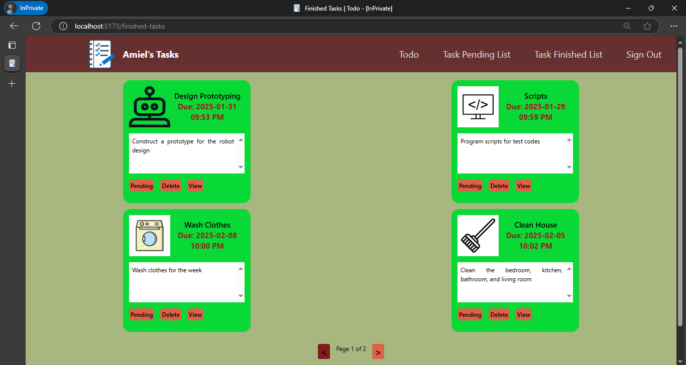

# Task View Page

- Click the **View** button
  
   

- Directs to the View Task page
  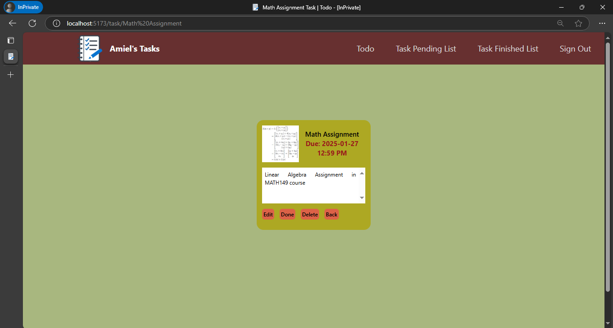

# Editing a task

- Click **Edit** button
  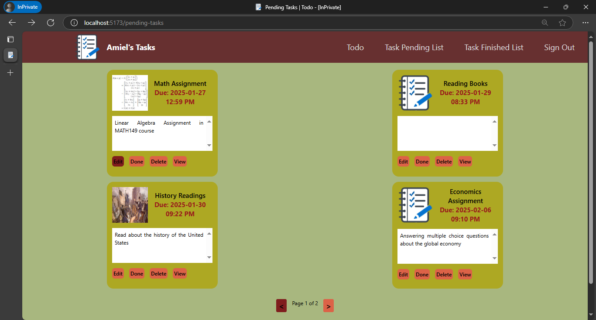
   

- Edit task name, description, or deadline
  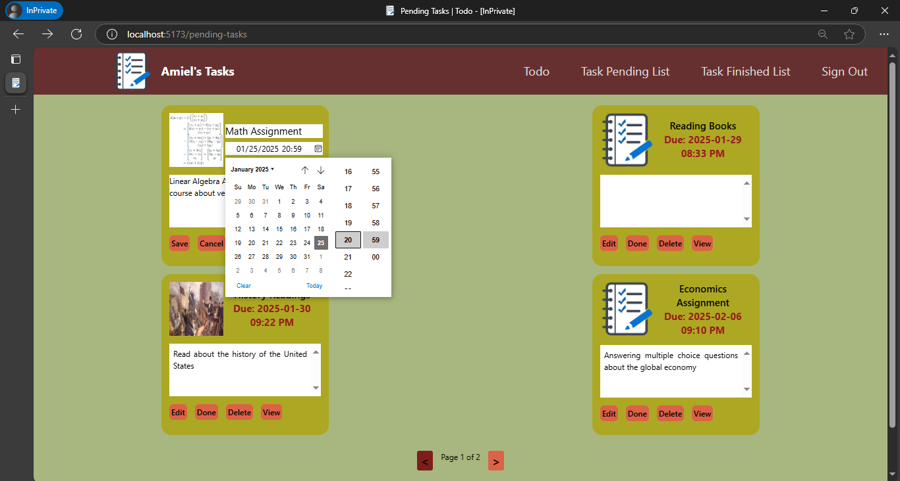
   

- Click **Save** button
  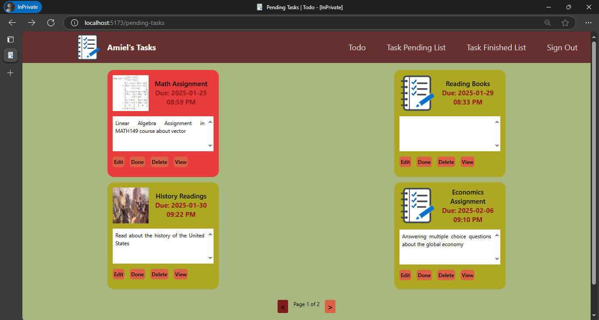

# When a task is beyond deadline

- Tasks are turned into **red** when they are due
  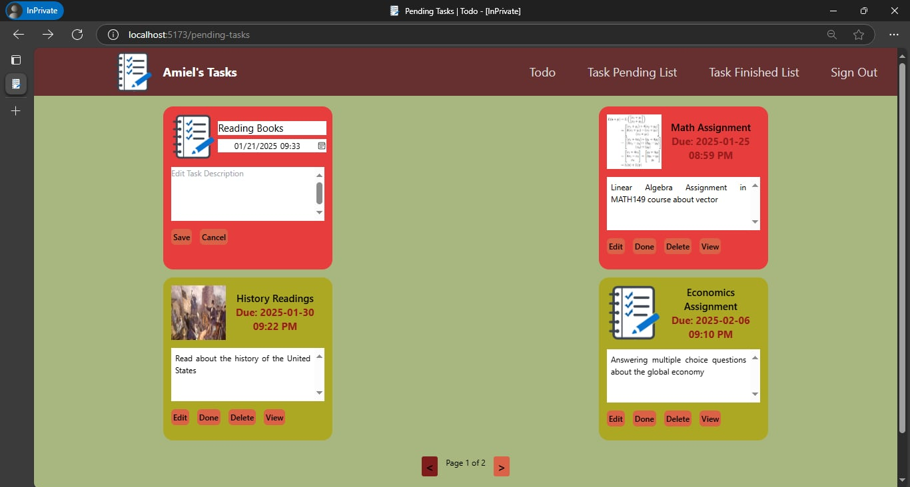

# Check Token in Cookies Through Browser Developer Tools

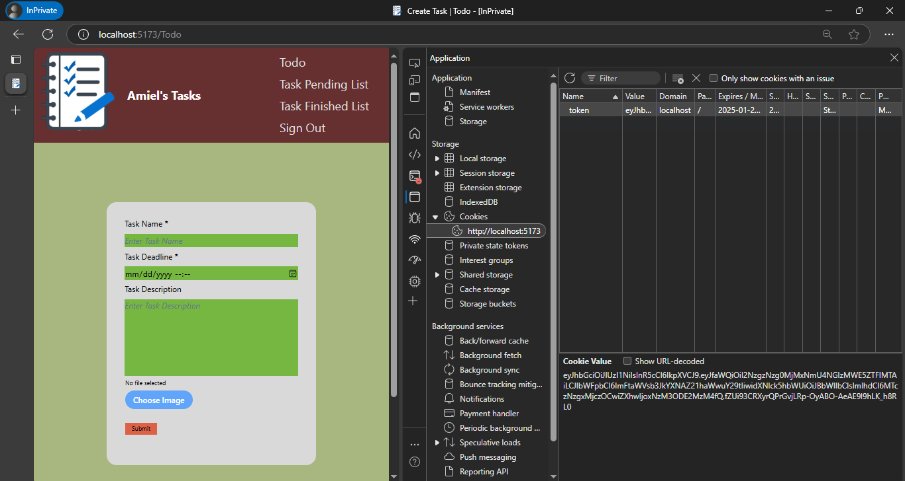
